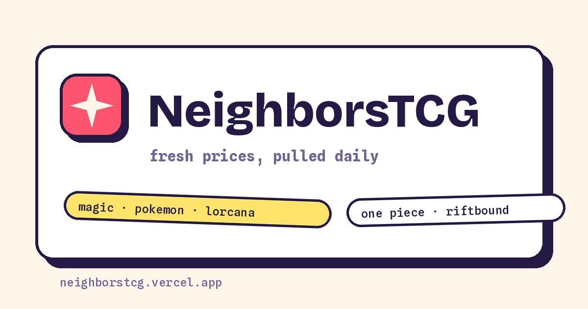

# tcg-market · NeighborsTCG

Daily market-price tracking for five trading card games — Magic: The
Gathering, Pokémon, Disney Lorcana, One Piece, and Riftbound — feeding
**[NeighborsTCG](https://neighborstcg.vercel.app)**, a hobby price-lookup
site built for friends and family.



## How it works

```
Scryfall bulk ─┐
pokemontcg.io ─┼─ collector (Python) ─ Parquet partitions in this repo
tcgapi.dev ────┘        │                data/game=<g>/date=<d>/prices.parquet
TCGCSV archives ─ backfill (2024-02-08 →)
                        │
                   dbt (DuckDB) ─ fct_daily_prices · dim_cards · reprint_lineage
                        │              └─ mirrored to MotherDuck (md:tcg_market)
                   JSON export ─ React site ─ Vercel
```

- **Collector** (`collector/`): one snapshot per game per day, scheduled
  06:40 UTC via GitHub Actions. Idempotent per date, atomic writes, loud
  failures, and a row-count guard that discards suspiciously shrunken
  partitions.
- **History** (`scripts/backfill_tcgcsv.py`): TCGplayer daily archives
  from [TCGCSV](https://tcgcsv.com) backfill prices to February 2024 —
  daily for One Piece/Lorcana/Riftbound, weekly for Magic and Pokémon
  (identity-mapped via Scryfall `tcgplayer_id` and name/number matching
  respectively).
- **Models** (`dbt/`): staging views normalize per-source schemas into
  `fct_daily_prices`; `dim_cards` groups printings into reprint lineages
  (Magic by oracle id); `reprint_lineage` is the backbone of a planned
  reprint-decay analysis. 21 build-time tests.
- **Site** (`site/`): React + Vite, static JSON data (search over 46k
  reprint groups, sharded card details), deployed to Vercel after every
  daily snapshot.

## Runbook

```bash
pip install -r collector/requirements.txt -r dbt/requirements.txt
python -m collector.snapshot                # today's prices (all games)
python -m collector.reference               # card metadata refresh (on demand)
dbt build --project-dir dbt --profiles-dir dbt
python scripts/export_site_data.py          # site JSON from the marts
cd site && npm ci && npm run dev
```

Secrets: `TCGAPI_KEY` (tcgapi.dev, Hobby tier), `POKEMONTCG_API_KEY`
(optional), `VERCEL_*`, `MOTHERDUCK_TOKEN`.

## Data notes

- Prices are daily snapshots of market aggregates (TCGplayer market /
  Scryfall / Cardmarket) — no individual sales, no graded prices.
- Card images are never stored here; the site hotlinks source CDNs and
  credits artists. Card names, sets, and imagery belong to their
  publishers; this is unofficial fan content.

Built by [Luc Nguyen](https://www.linkedin.com/in/luchnguyen/) ·
implementation AI-assisted (Claude Code), judgment calls mine.
